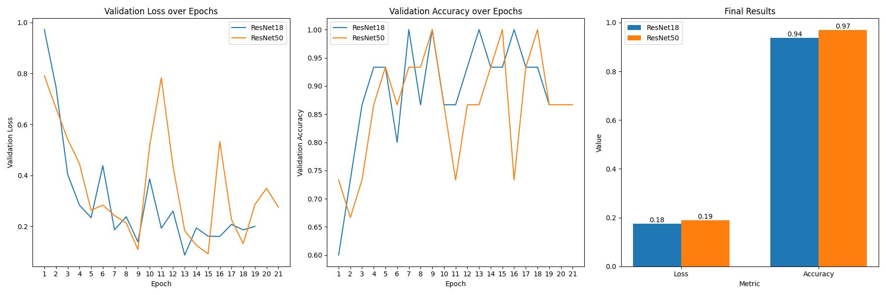

# ML2 Project

Welcome to my project for the oral exam in ML2. Please read this README file carefully, especially the setup section.

## Contents
- How to set up and run the project on your device
- Project goal and explanation
- Data collection
- Code structure
- Interpretation and validation
- Possible improvements

## How to set up the project on your device

First of all, this project was developed on a Windows device and the entire code was written in Python version **3.12.1**.
You can set up the project as we did in the MDM course.
1. Clone this project.
2. Ensure that you are in the project folder and not in a parent directory.
2. Create a new Python virtual environment. Here are the commands for Visual Studio on Windows:
    - `python -m venv .venv`
    - `.venv\Scripts\activate`
3. Once you have activated the virtual environment, install the packages listed in `requirements.txt`. Use the following command:
    - `pip install -r requirements.txt`
4. You need an OpenAI API key to run this project. Insert the API key in the file "app.py" at the placeholder "HERE THE KEY".
   If you don't have your own OpenAI API key, please contact thayath1@students.zhaw.ch.
5. To run the project, execute the Python file "app.py" `flask run`:
    - This project uses the Flask framework.
    - The model is already trained and saved as "trained18_model.pth".
    - Please note that the files "prediction_results.json," "results_api.json," and the mp3 file will only be created once the code is running and a request has been sent.
    - Further information can be found on the frontend !!.

## Project goal and explanation

This chatbot is specialized in recognizing the artist of a painting and providing additional information about the artist and the painting. But who could benefit from this? Primarily, this project is intended for blind individuals who have a passion for artworks. The bot enables a blind person to describe a piece of art and obtain information about it.

How does the project work?
The bot consists of two components: a self-trained model and integration with the OpenAI API. When an image is uploaded, the self-trained model first identifies the artist of the painting. Then, the outputs of the model are passed to the OpenAI API to generate further information about the painting. Now, the question arises, why don't I send the image directly to the OpenAI API for information, or why is the self-trained model needed?

Although ChatGBT provides a wealth of information, I've noticed that it sometimes struggles to correctly identify less well-known paintings. Therefore, I use a specially trained model that first identifies the artist of the painting, allowing ChatGBT to better narrow down the possibilities and provide the correct information. Of course, it's possible that the self-trained model misclassifies the image, but ChatGBT usually recognizes this.

Another important question is how a blind person can read the output of the bot. To address this, I use the "tts-1" model from OpenAI. This model generates a realistic voice from text, allowing the output to be played as sound. Naturally, it would also be useful to enable input via voice control, as blind individuals may find it challenging to type questions or upload images. However, integrating these features would exceed the scope of this project.

## Data collection

To train the model with images, I scrape the data from various websites (mainly Wikipedia; you can find the code in the 'scraper' folder). Currently, I have collected paintings by Caravaggio, Da Vinci, and Picasso. The problem here is that the number of images for each artist is limited, and furthermore, some artists have painted over 100 paintings over time, while others have painted less than 50. This issue complicates the training process.

## Code Structure

### Training

The code begins with training the model, which takes place in the file "training_ResNet18.py". The model is trained using PyTorch and ResNet18. The following parameters were set for the training: Epoch: 32 and batch size: 32. Once the training is complete, a .pth file is created, and the training data is saved in JSON format "training18_results.json" in the "results" folder. How the data is prepared and additional information can be found in the section "Interpretation and Validation"

### Prediction

The file "prediction.py" is responsible for the predictions. This file also generates a JSON file "predicted_class" with the predictions in the "results" folder. This JSON file will later be used for prompting.

### OpenAI - ChatGBT

As mentioned in the project goal, the results of the model are passed to the OpenAI API to generate additional information about the image. The backend file "app.py" is responsible for this.

The "app.py" file contains seven endpoints:

- serve_index(): Serves the index file for the frontend application.
- handle_text(): Processes text messages from the user and returns the chatbot's response. The responses are additionally saved in a JSON file to generate speech.
- handle_image(): Processes image messages from the user and returns the chatbot's response. This endpoint uses the predicted_class JSON file for prompting. The model results are integrated into the prompt. The responses are also saved in a JSON file to generate speech.
- handle_prediction(): Accepts image files, performs image prediction, and returns the predicted class.
- get_last_prediction(): Returns the most recently predicted class, allowing the most recent model results to be used in the prompt when multiple images are uploaded.
- create_speech(): Creates a speech file based on the last chat response (results_api.json). The mp3 file is also saved in the results folder.
- get_speech(): Returns the created speech file.To remember previous conversations, Flask-Session is used to store the conversations locally.

### Frontend
The frontend consists of index.html, style.css, and script.js. The JavaScript file acts as an interface between the backend and frontend.

## Interpretation and validation

As mentioned earlier, I have trained a model that can classify who painted a painting. The results of this model are then passed to the OpenAI API. The model achieves an accuracy of 0.94 and a loss of 0.18.

Initially, the plan was to train two models: one to identify the artist and another to identify the name of the painting. This would have made it even easier for ChatGPT to narrow down the possibilities and provide accurate information. Unfortunately, training the model to identify the names of paintings was too labor-intensive and collecting the data was difficult. For example, I was able to scrape 50 different artworks by Picasso. For the model to identify the names of these paintings as accurately as the model that identifies the artists, it would need to correctly identify the names of these 50 different artworks. Collecting data for these 50 paintings is very time-consuming. Additionally, there is a risk that one of the models could provide incorrect information to the OpenAI API, which could confuse ChatGPT.

The image training was conducted using ResNet18 and ResNet50 to examine how this affects performance. ML tools and techniques such as feature engineering, optimization techniques, loss functions, learning rate scheduling, early stopping, efficient data loading mechanisms, and custom model adjustments were utilized for the training.

The training results of the two models are as follows:

From the graph, it can be seen that ResNet18 appears to be more stable and consistent in both validation loss and validation accuracy. This suggests that ResNet18 generalizes better and is less prone to overfitting. ResNet50, on the other hand, shows higher test accuracy, indicating that it can make more precise predictions.

Since the model was trained with only 150 images, which is a relatively small amount, stability is an important factor. Fluctuations can indicate overfitting, especially with smaller datasets.

Due to its stability and consistency, I chose ResNet18, particularly when the amount of data is limited. However, if the highest accuracy is the primary goal and additional data or better regularization is available, ResNet50 might be the better choice due to its somewhat higher accuracy.

## Possible improvements

To enable blind people to transmit images or text to the chatbot, specific features need to be integrated. For instance, an image could be captured with a camera and then passed on to the bot. Using OpenAI's "whisper-1" model, spoken sentences could be converted into text and also transmitted to the bot.

Another model, similar to the one described above, could be used to alleviate the load on ChatGPT and collect more data, covering a broader spectrum of artworks.

The backend code could be made more efficient. For example, the endpoints handle_text() and handle_image() could be combined to improve performance.

Additionally, conversations and various results are stored locally. Databases like MongoDB or services like Azure could be helpful in this regard.

The frontend currently only fulfills the most essential functions and therefore has potential for further development.

